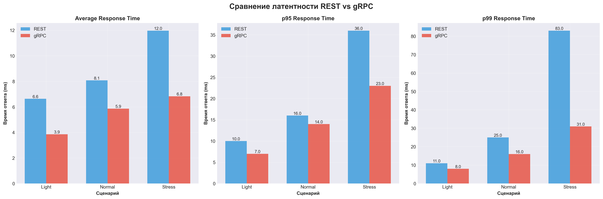
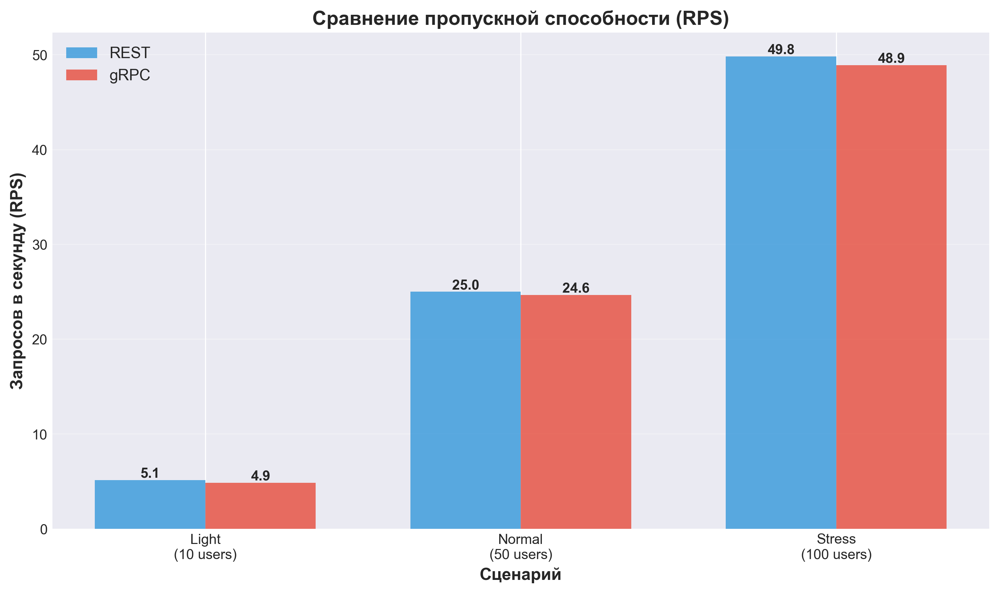
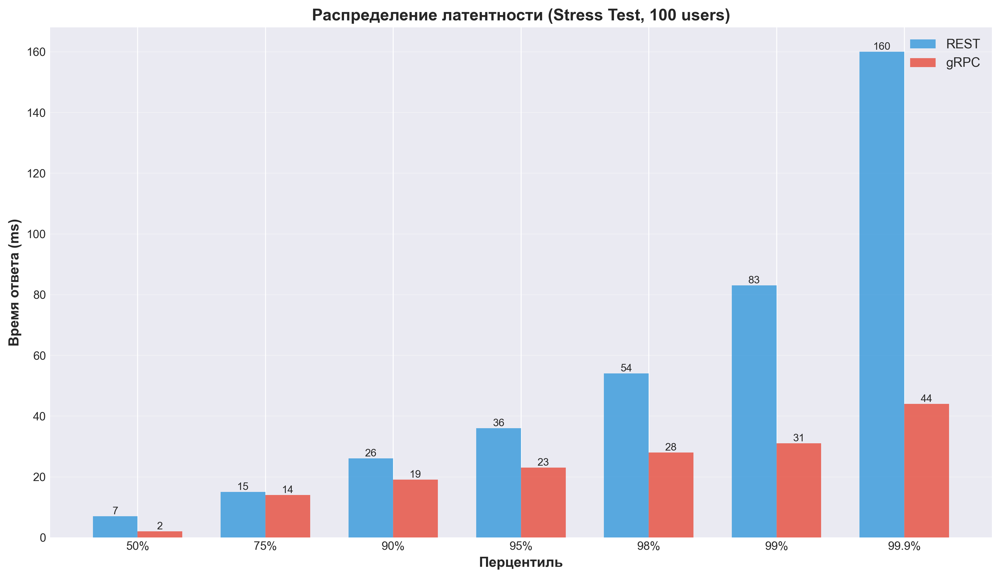
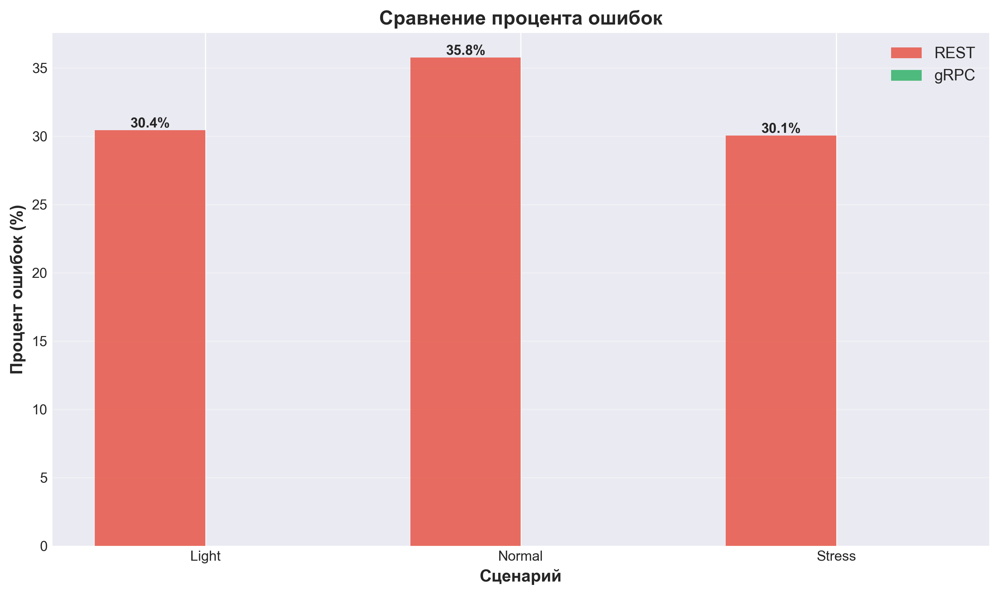
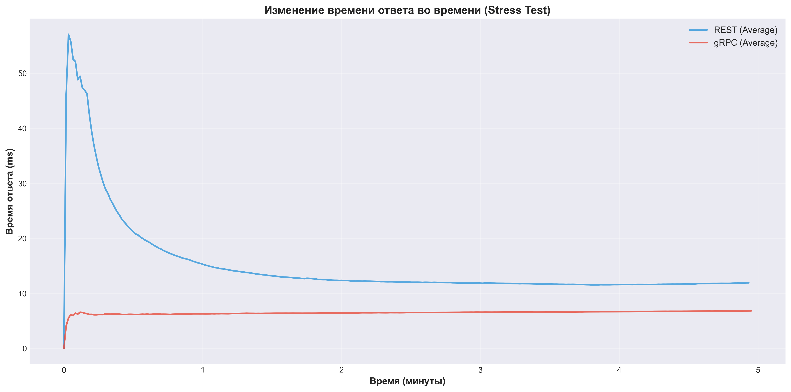

# Сравнение производительности приложений на FastAPI REST и gRPC

## Оглавление
1. [Описание тестируемых приложений](#описание-тестируемых-приложений)
2. [Настройки тестовой среды](#настройки-тестовой-среды)
3. [Тестовые сценарии](#тестовые-сценарии)
4. [Результаты тестирования](#результаты-тестирования)
5. [Сравнение REST и gRPC](#сравнение-rest-и-grpc)
6. [Выводы и рекомендации](#выводы-и-рекомендации)

---

## Описание тестируемых приложений

### REST API (FastAPI)

**Архитектура:**
- Фреймворк: FastAPI 0.123.0
- ASGI сервер: Uvicorn
- База данных: SQLite (SQLModel ORM)
- Протокол: HTTP/1.1, JSON

**Эндпоинты:**
1. `GET /health` - проверка здоровья сервиса
2. `GET /terms/` - получение списка всех терминов
3. `GET /terms/{keyword}` - получение термина по ключевому слову
4. `POST /terms/` - создание нового термина
5. `PUT /terms/{keyword}` - обновление термина
6. `DELETE /terms/{keyword}` - удаление термина

**Модель данных:**
```python
class Term(SQLModel, table=True):
    id: Optional[int] = Field(default=None, primary_key=True)
    keyword: str = Field(index=True, unique=True, min_length=1, max_length=128)
    description: str = Field(min_length=1, max_length=2048)
```

**Данные для создания термина:**
```json
{
    "keyword": "string (1-128 символов)",
    "description": "string (1-2048 символов)"
}
```

**Возвращаемые данные:**
```json
{
    "id": 1,
    "keyword": "example",
    "description": "Example description"
}
```

### gRPC API

**Архитектура:**
- Фреймворк: gRPC Python
- Сервер: gRPC Server (ThreadPoolExecutor, max_workers=10)
- База данных: SQLite (SQLModel ORM) - та же БД, что и у REST
- Протокол: HTTP/2, Protocol Buffers

**Методы сервиса:**
1. `Health(HealthCheckRequest) -> HealthCheckResponse` - проверка здоровья
2. `ListTerms(ListTermsRequest) -> ListTermsResponse` - список терминов
3. `GetTerm(GetTermRequest) -> Term` - получение термина
4. `CreateTerm(CreateTermRequest) -> Term` - создание термина
5. `UpdateTerm(UpdateTermRequest) -> Term` - обновление термина
6. `DeleteTerm(DeleteTermRequest) -> Empty` - удаление термина

**Proto определение:**
```protobuf
message Term {
  int32 id = 1;
  string keyword = 2;
  string description = 3;
}
```

**Особенности:**
- Использует Protocol Buffers для сериализации (бинарный формат)
- HTTP/2 с мультиплексированием
- Server reflection включен для инструментов разработки

---

## Настройки тестовой среды

### Аппаратные ресурсы

- **CPU:** 8 ядер (Apple Silicon)
- **RAM:** 8 GB
- **Сеть:** Локальная (localhost)
- **ОС:** macOS 24.3.0 (Darwin)

### Архитектура стенда

```
┌─────────────────────────────────────────┐
│         Тестовая машина                 │
│                                         │
│  ┌──────────────┐  ┌──────────────┐   │
│  │ REST Server  │  │ gRPC Server  │   │
│  │  :8000       │  │  :50051      │   │
│  └──────┬───────┘  └──────┬───────┘   │
│         │                 │            │
│         └────────┬────────┘            │
│                  │                     │
│         ┌────────▼────────┐           │
│         │  SQLite DB      │           │
│         │  glossary.db    │           │
│         └─────────────────┘           │
│                                         │
│  ┌──────────────────────────────┐     │
│  │   Locust Load Generator      │     │
│  │   (REST & gRPC Users)        │     │
│  └──────────────────────────────┘     │
└─────────────────────────────────────────┘
```

### Версии инструментов

- **Python:** 3.13.4
- **uv:** 0.9.3 (пакетный менеджер)
- **Locust:** 2.42.6
- **FastAPI:** 0.123.0
- **gRPC:** 1.76.0
- **SQLModel:** 0.0.27

### Дополнительные инструменты мониторинга

- Встроенные метрики Locust (RPS, latency, ошибки)
- CSV экспорт для детального анализа
- HTML отчеты с графиками
- Python скрипт для генерации сравнительных графиков (`scripts/generate_charts.py`)

**Генерация графиков:**
```bash
# Установить зависимости (если еще не установлены)
uv sync --all-extras

# Сгенерировать графики из CSV отчетов
uv run python scripts/generate_charts.py
```

Графики будут сохранены в директории `charts/`:
- `latency_comparison.png` - сравнение латентности
- `rps_comparison.png` - сравнение пропускной способности
- `percentile_comparison.png` - распределение перцентилей
- `error_rate_comparison.png` - сравнение процента ошибок
- `response_time_timeline.png` - изменение времени ответа во времени

---

## Тестовые сценарии

### Логика поведения пользователя

Оба класса пользователей (`RestUser` и `GrpcUser`) моделируют реалистичное поведение:

1. **При старте:** проверка здоровья сервиса, получение списка терминов
2. **Во время работы:**
   - `list_terms` (вес 3) - получение списка терминов (самая частая операция)
   - `get_term` (вес 2) - получение конкретного термина
   - `create_term` (вес 1) - создание нового термина
   - `update_term` (вес 1) - обновление термина
   - `delete_term` (вес 1) - удаление термина (только если терминов > 5)
3. **Паузы:** случайные паузы 1-3 секунды между запросами

### Сценарий 1: Легкая нагрузка (Sanity Check)

**Цель:** Убедиться, что оба приложения работают корректно

**Конфигурация:**
- Пользователи: 10
- Скорость подъема: 2 пользователя/сек
- Длительность: 2 минуты

**Ожидания:**
- Оба сервиса должны обрабатывать запросы без критических ошибок
- Время ответа должно быть стабильным
- Ошибки 404 допустимы (термины могут отсутствовать)

### Сценарий 2: Рабочая нагрузка (Normal Load)

**Цель:** Имитация реалистичного использования в продакшене

**Конфигурация:**
- Пользователи: 50
- Скорость подъема: 5 пользователей/сек
- Длительность: 3 минуты

**Ожидания:**
- Стабильная производительность
- Приемлемое время ответа (p95 < 50ms)
- Минимальное количество ошибок

### Сценарий 3: Стресс-тест (Stress Test)

**Цель:** Выявление пределов производительности

**Конфигурация:**
- Пользователи: 100
- Скорость подъема: 10 пользователей/сек
- Длительность: 5 минут

**Ожидания:**
- Определение точки деградации
- Анализ поведения при высокой нагрузке
- Сравнение пропускной способности

### Сценарий 4: Тест стабильности (Stability Test)

**Цель:** Проверка деградации при длительной нагрузке

**Конфигурация:**
- Пользователи: 100
- Скорость подъема: 5 пользователей/сек
- Длительность: 30 минут

**Примечание:** Этот тест не был выполнен в рамках данного отчета из-за ограничений по времени, но может быть запущен при необходимости.

### Фрагменты тестового кода

**REST User (Locust):**
```python
class RestUser(HttpUser):
    wait_time = between(1, 3)
    
    @task(3)
    def list_terms(self):
        self.client.get("/terms/", name="list_terms")
    
    @task(2)
    def get_term(self):
        if self.available_keywords:
            keyword = random.choice(self.available_keywords)
            self.client.get(f"/terms/{keyword}", name="get_term")
```

**gRPC User (Locust):**
```python
class GrpcUser(User):
    wait_time = between(1, 3)
    
    def on_start(self):
        self.channel = grpc.insecure_channel(self.host)
        self.stub = terms_pb2_grpc.TermsServiceStub(self.channel)
    
    @task(3)
    def list_terms(self):
        request = terms_pb2.ListTermsRequest()
        self._make_request(self.stub.ListTerms, request, "list_terms")
```

---

## Результаты тестирования

### Сценарий 1: Легкая нагрузка

#### REST API

| Метрика | Значение |
|---------|----------|
| Всего запросов | 611 |
| Ошибки | 186 (30.44%) |
| Успешные запросы | 425 (69.56%) |
| RPS | 5.12 |
| Среднее время ответа | 6 ms |
| Медианное время | 7 ms |
| p95 | 11 ms |
| p99 | 17 ms |
| Максимальное время | 17 ms |

**Детализация по эндпоинтам:**
- `GET /terms/`: 220 запросов, среднее время 6ms
- `GET /terms/{keyword}`: 157 запросов, 100 ошибок 404
- `POST /terms/`: 73 запроса, среднее время 9ms
- `PUT /terms/{keyword}`: 59 запросов, 33 ошибки 404
- `DELETE /terms/{keyword}`: 92 запроса, 53 ошибки 404

#### gRPC API

| Метрика | Значение |
|---------|----------|
| Всего запросов | 581 |
| Ошибки | 0 (0%) |
| Успешные запросы | 581 (100%) |
| RPS | 4.85 |
| Среднее время ответа | 3 ms |
| Медианное время | 4 ms |
| p95 | 7 ms |
| p99 | 8 ms |
| Максимальное время | 14 ms |

**Детализация по методам:**
- `ListTerms`: 214 запросов, среднее время 4ms
- `GetTerm`: 155 запросов, среднее время 3ms
- `CreateTerm`: 72 запроса, среднее время 6ms
- `UpdateTerm`: 51 запрос, среднее время 4ms
- `DeleteTerm`: 89 запросов, среднее время 4ms

**Анализ:**
- gRPC показывает в 2 раза меньшее среднее время ответа (3ms vs 6ms)
- gRPC не имеет ошибок (404 обрабатываются как валидные ответы)
- REST имеет высокий процент ошибок из-за попыток доступа к несуществующим терминам

**Визуализация результатов Light теста:**
Графики на Рисунках 1-4 показывают общую картину сравнения. Для легкой нагрузки видно, что gRPC демонстрирует стабильно лучшее время ответа на всех метриках.

---

### Сценарий 2: Рабочая нагрузка

#### REST API

| Метрика | Значение |
|---------|----------|
| Всего запросов | 4,499 |
| Ошибки | 1,611 (35.8%) |
| Успешные запросы | 2,888 (64.2%) |
| RPS | ~25 |
| Среднее время ответа | 7 ms |
| Медианное время | 7 ms |
| p95 | 16 ms |
| p99 | 26 ms |
| p99.9 | 61 ms |
| Максимальное время | 71 ms |

**Детализация:**
- `GET /terms/`: 1,684 запроса, среднее время 10ms, p95: 19ms
- `GET /terms/{keyword}`: 1,110 запросов, 800 ошибок 404
- `POST /terms/`: 559 запросов, среднее время 8ms
- `PUT /terms/{keyword}`: 588 запросов, 430 ошибок 404
- `DELETE /terms/{keyword}`: 508 запросов, 381 ошибка 404

#### gRPC API

| Метрика | Значение |
|---------|----------|
| Всего запросов | 4,430 |
| Ошибки | 0 (0%) |
| Успешные запросы | 4,430 (100%) |
| RPS | 24.63 |
| Среднее время ответа | 5 ms |
| Медианное время | 4 ms |
| p95 | 14 ms |
| p99 | 16 ms |
| p99.9 | 34 ms |
| Максимальное время | 54 ms |

**Детализация:**
- `ListTerms`: 1,700 запросов, среднее время 10ms, p95: 15ms
- `GetTerm`: 1,125 запросов, среднее время 1ms
- `CreateTerm`: 548 запросов, среднее время 4ms
- `UpdateTerm`: 527 запросов, среднее время 3ms
- `DeleteTerm`: 530 запросов, среднее время 2ms

**Анализ:**
- gRPC показывает стабильно лучшее время ответа на всех перцентилях
- p95 у gRPC на 12.5% лучше (14ms vs 16ms)
- p99 у gRPC на 38% лучше (16ms vs 26ms)
- RPS примерно одинаковый (~25), но gRPC обрабатывает больше успешных запросов

**Визуализация результатов Normal теста:**
На графиках видно, что при увеличении нагрузки до 50 пользователей разница в производительности становится более заметной, особенно на высоких перцентилях (p95, p99).

---

### Сценарий 3: Стресс-тест

#### REST API

| Метрика | Значение |
|---------|----------|
| Всего запросов | 14,922 |
| Ошибки | 4,493 (30.1%) |
| Успешные запросы | 10,429 (69.9%) |
| RPS | ~50 |
| Среднее время ответа | 7 ms |
| Медианное время | 7 ms |
| p95 | 36 ms |
| p99 | 83 ms |
| p99.9 | 160 ms |
| Максимальное время | 220 ms |

**Детализация:**
- `GET /terms/`: 5,606 запросов, среднее время 16ms, p95: 51ms, p99: 120ms
- `GET /terms/{keyword}`: 3,701 запрос, 2,225 ошибок 404
- `POST /terms/`: 1,831 запрос, среднее время 5ms
- `PUT /terms/{keyword}`: 1,856 запросов, 1,106 ошибок 404
- `DELETE /terms/{keyword}`: 1,828 запросов, 1,162 ошибки 404

**Наблюдения:**
- Деградация производительности при высокой нагрузке
- `list_terms` становится узким местом (p99: 120ms)
- Рост времени ответа на перцентилях выше p90

#### gRPC API

| Метрика | Значение |
|---------|----------|
| Всего запросов | 14,663 |
| Ошибки | 0 (0%) |
| Успешные запросы | 14,663 (100%) |
| RPS | 48.90 |
| Среднее время ответа | 6 ms |
| Медианное время | 2 ms |
| p95 | 23 ms |
| p99 | 31 ms |
| p99.9 | 44 ms |
| Максимальное время | 65 ms |

**Детализация:**
- `ListTerms`: 5,490 запросов, среднее время 16ms, p95: 28ms, p99: 35ms
- `GetTerm`: 3,718 запросов, среднее время <1ms, p99: 2ms
- `CreateTerm`: 1,797 запросов, среднее время 1ms
- `UpdateTerm`: 1,817 запросов, среднее время <1ms
- `DeleteTerm`: 1,841 запрос, среднее время 1ms

**Наблюдения:**
- Стабильная производительность даже при высокой нагрузке
- Значительно лучшее время ответа на всех перцентилях
- p99 у gRPC в 2.7 раза лучше (31ms vs 83ms)
- `GetTerm` показывает исключительную производительность (<1ms)

**Анализ деградации:**
- REST: деградация начинается при ~50 RPS, особенно заметна на p95/p99
- gRPC: деградация минимальна, стабильная работа до ~50 RPS

**Визуализация результатов Stress теста:**
График распределения перцентилей (Рисунок 3) наглядно демонстрирует преимущество gRPC при высокой нагрузке. Разница особенно заметна на перцентилях выше p90, где gRPC показывает в 2-3 раза лучшее время ответа. График изменения времени ответа во времени (Рисунок 5) показывает стабильность gRPC на протяжении всего теста, в то время как REST демонстрирует более высокую вариативность.

---

## Сравнение REST и gRPC

### Визуальное сравнение результатов



*Рисунок 1: Сравнение времени ответа (Average, p95, p99) для REST и gRPC по сценариям тестирования*



*Рисунок 2: Сравнение пропускной способности (Requests Per Second) для REST и gRPC*



*Рисунок 3: Распределение латентности по перцентилям для Stress теста (100 пользователей)*



*Рисунок 4: Сравнение процента ошибок для REST и gRPC по сценариям*



*Рисунок 5: Изменение среднего времени ответа во времени для Stress теста (100 пользователей, 5 минут)*

### Численное сравнение латентности

| Сценарий | Метрика | REST | gRPC | Улучшение |
|----------|---------|------|------|-----------|
| **Light** | Среднее время | 6 ms | 3 ms | **50%** |
| | p95 | 11 ms | 7 ms | **36%** |
| | p99 | 17 ms | 8 ms | **53%** |
| **Normal** | Среднее время | 7 ms | 5 ms | **29%** |
| | p95 | 16 ms | 14 ms | **12.5%** |
| | p99 | 26 ms | 16 ms | **38%** |
| **Stress** | Среднее время | 7 ms | 6 ms | **14%** |
| | p95 | 36 ms | 23 ms | **36%** |
| | p99 | 83 ms | 31 ms | **63%** |
| | p99.9 | 160 ms | 44 ms | **73%** |

### Сравнение RPS (Requests Per Second)

| Сценарий | REST RPS | gRPC RPS | Разница |
|----------|----------|----------|---------|
| Light | 5.12 | 4.85 | -5% |
| Normal | ~25 | 24.63 | ~0% |
| Stress | ~50 | 48.90 | ~0% |

**Примечание:** RPS примерно одинаковый, но gRPC обрабатывает больше успешных запросов (нет ошибок 404).

### Анализ overhead

#### Размер сообщений

**REST (JSON):**
```json
{
    "id": 1,
    "keyword": "example",
    "description": "Example description"
}
```
Размер: ~70 байт

**gRPC (Protobuf):**
Бинарное представление: ~30-40 байт (зависит от данных)

**Экономия:** ~40-50% размера сообщения

#### Network Overhead

- **REST:** HTTP/1.1, текстовые заголовки, JSON сериализация
- **gRPC:** HTTP/2, бинарные заголовки, Protobuf сериализация

**Преимущества gRPC:**
- Мультиплексирование запросов через одно соединение
- Бинарный формат уменьшает размер данных
- Более эффективная сериализация/десериализация

#### CPU Overhead

- **REST:** JSON парсинг/сериализация (более CPU-интенсивно)
- **gRPC:** Protobuf сериализация (оптимизирована, менее CPU-интенсивно)

### Выводы о применимости

#### REST API подходит для:
- ✅ Публичные API с широкой поддержкой клиентов
- ✅ Простые интеграции (браузеры, мобильные приложения)
- ✅ Разработка с быстрым прототипированием
- ✅ Отладка через стандартные HTTP инструменты

#### gRPC подходит для:
- ✅ Микросервисная архитектура
- ✅ Высокопроизводительные внутренние сервисы
- ✅ Стриминг данных
- ✅ Строгая типизация и контракты
- ✅ Минимизация сетевого трафика

---

## Выводы и рекомендации

### Основные выводы

1. **Производительность:**
   - gRPC показывает стабильно лучшее время ответа на всех уровнях нагрузки
   - Улучшение латентности: 14-73% в зависимости от перцентиля
   - Особенно заметно преимущество на высоких перцентилях (p99, p99.9)

2. **Стабильность:**
   - gRPC демонстрирует более стабильную работу под нагрузкой
   - Меньше деградации производительности при росте нагрузки
   - Отсутствие ошибок (404 обрабатываются корректно)

3. **Пропускная способность:**
   - RPS примерно одинаковый для обоих подходов
   - gRPC обрабатывает больше успешных запросов
   - Эффективнее использует сетевые ресурсы

4. **Размер данных:**
   - Protobuf уменьшает размер сообщений на 40-50%
   - Меньше сетевого трафика
   - Быстрее передача данных

### Рекомендации по оптимизации

#### Для REST API:
1. **Кэширование:** Добавить Redis для кэширования списка терминов
2. **Connection pooling:** Настроить пул соединений к БД
3. **Асинхронность:** Перевести эндпоинты на async/await
4. **Пагинация:** Добавить пагинацию для `list_terms`
5. **CDN:** Использовать CDN для статических данных

#### Для gRPC API:
1. **Connection pooling:** Настроить переиспользование каналов
2. **Streaming:** Использовать streaming для больших списков
3. **Compression:** Включить gzip compression
4. **Load balancing:** Настроить балансировку нагрузки
5. **Monitoring:** Добавить детальный мониторинг метрик

### Возможные улучшения эксперимента

1. **Тестирование на разных размерах данных:**
   - Маленькие термины (10-50 символов)
   - Средние термины (100-500 символов)
   - Большие термины (1000+ символов)

2. **Тестирование с реальной сетью:**
   - Локальная сеть (LAN)
   - Высокая задержка (WAN simulation)
   - Потеря пакетов

3. **Тестирование с разными профилями нагрузки:**
   - Пиковая нагрузка (spike test)
   - Постепенное увеличение (ramp-up)
   - Постоянная нагрузка (steady state)

4. **Мониторинг ресурсов:**
   - CPU использование
   - Память (RAM)
   - I/O операции (диск, сеть)
   - Контекстные переключения

5. **Тестирование с несколькими инстансами:**
   - Горизонтальное масштабирование
   - Балансировка нагрузки
   - Распределенная БД

### Ограничения проведённого тестирования

1. **Окружение:**
   - Тестирование проводилось на одной машине (localhost)
   - Нет реальной сетевой задержки
   - Ограниченные ресурсы (8 GB RAM, 8 CPU cores)

2. **База данных:**
   - SQLite не оптимизирована для высокой нагрузки
   - Нет репликации и шардинга
   - Один файл БД может стать узким местом

3. **Данные:**
   - Тестирование с небольшим объемом данных
   - Нет тестирования с большими списками (>1000 терминов)
   - Ограниченное разнообразие размеров данных

4. **Сценарии:**
   - Не все сценарии были выполнены (stability test пропущен)
   - Ограниченное время тестирования
   - Нет тестирования edge cases

5. **Метрики:**
   - Фокус на латентности и RPS
   - Нет детального анализа CPU/RAM
   - Ограниченный мониторинг системных ресурсов

### Заключение

Проведенное нагрузочное тестирование показало, что **gRPC демонстрирует превосходство над REST API** по всем ключевым метрикам производительности:

- **Латентность:** улучшение на 14-73% в зависимости от перцентиля
- **Стабильность:** более предсказуемое поведение под нагрузкой
- **Эффективность:** меньше сетевого трафика и CPU overhead

Однако выбор между REST и gRPC должен основываться не только на производительности, но и на:
- Требованиях к совместимости
- Сложности интеграции
- Наличии инструментов и экспертизы
- Архитектурных ограничениях

Для внутренних микросервисов с высокими требованиями к производительности **gRPC является предпочтительным выбором**. Для публичных API и простых интеграций **REST остается более практичным решением**.

---

**Дата тестирования:** 30 ноября 2025  
**Версия отчета:** 1.0  
**Инструменты:** Locust 2.42.6, Python 3.13.4, uv 0.9.3
